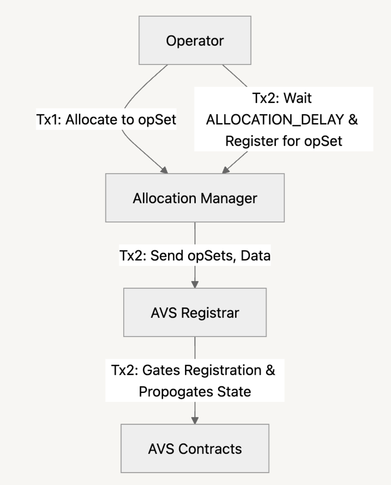

[middleware-guide-link]: #quick-start-guide-to-build-avs-contracts
[operator-set-guide-link]: https://www.blog.eigenlayer.xyz/introducing-the-eigenlayer-security-model
[uam-link]: https://github.com/eigenfoundation/ELIPs/blob/main/ELIPs/ELIP-003.md
[avs-sync-link]: https://github.com/Layr-Labs/avs-sync
[uam-elip-link]: https://github.com/eigenfoundation/ELIPs/blob/main/ELIPs/ELIP-003.md
# Purpose
This document aims to describe and summarize how autonomous verifiable services (AVSs) building on EigenLayer interact with the core EigenLayer protocol. Currently, this doc explains how AVS developers can use the APIs for:
- enabling operators to opt-in to the AVS,
- enabling operators to opt-out (withdraw stake) from the AVS,
- enabling operators to continuously update their commitments to middlewares,
- enabling AVSs to create operator sets,
- enabling AVSs to submit rewards for operators and stakers, and
- enabling AVSs to slash operators for malicious behaviour.

# Introduction
In designing EigenLayer, the EigenLabs team aspired to make minimal assumptions about the structure of AVSs built on top of it. This repo contains code that can be extended, used directly, or consulted as a reference in building an AVS on top of EigenLayer. All the middleware contracts are AVS-specific and need to be deployed separately by AVS teams which interface with the EigenLayer core contracts, deployed by EigenLabs.

## Important Terminology
- **Tasks** - A task in EigenLayer is the smallest unit of work that operators commit to perform when serving an AVS. These tasks may be associated with one or more operator sets within the AVS.
- **Strategies** - A strategy in EigenLayer is a contract that holds staker deposits, i.e. it controls one or more asset(s) that can be restaked. EigenLayer's strategy design is flexible and open, meaning anyone can permissionlessly deploy a strategy using the `StrategyManager` in the core contracts.
- **Operator Sets** - An operator set in EigenLayer is a way to distinguish different classes of operators within an AVS. Operators may be separated on the basis of the tasks they perform, supported strategies, rewards they recieve or, the slashing conditions operators are subject to. There are two types of operator sets that an AVS may create, total delegated stake and unique stake. See [this][operator-set-guide-link] blog post for further information on the different types of operator sets.

# Key Design Considerations
1. *Decomposition into "Tasks"*:  
    EigenLayer assumes that an AVS manages tasks that are executed over time by a registered operator. Each task is associated with the time period during which the AVS's operators' stakes are placed "at stake", i.e. potentially subject to slashing. Examples of tasks could be:
    - Hosting and serving a “DataStore” in the context of EigenDA
    - Posting a state root of another blockchain for a bridge service

2. *Stake is "At Stake" on Tasks for a Finite Duration*:  
    It is assumed that every task (eventually) resolves. Each operator places their stake in EigenLayer “at stake” on the tasks that they perform. In order to “release” the stake (e.g. so the operator can withdraw their funds), these tasks need to eventually resolve. It is RECOMMENDED, but not required that a predefined duration is specified in the AVS contract for each task. As a guideline, the EigenLabs team believes that the duration of a task should be aligned with the longest reasonable duration that would be acceptable for an operator to keep funds “at stake”. An AVS builder should recognize that extending the duration of a task may impose significant negative externalities on the stakers of EigenLayer, and may disincentivize operators from opting-in to serving their application (so that they can attract more delegated stake). At the time of writing, the `DEALLOCATION_DELAY` which is the time it takes for stake to be deallocated from an AVS is 14 days.

3. *Services Slash Only Objectively Attributable Behavior*:  
    EigenLayer is built to support slashing as a result of an on-chain checkable, objectively attributable action. An AVS SHOULD slash in EigenLayer only for such provable and attributable behavior. It is expected that operators will be very hesitant to opt-in to services that slash for other types of behavior, and other services may even choose to exclude operators who have opted-in to serving one or more AVSs with such “subjective slashing conditions”, as these slashing conditions present a significant challenge for risk modeling, and may be perceived as more dangerous in general. Some examples of on-chain checkable, objectively attributable behavior: 
    - double-signing a block in Ethereum, but NOT inactivity leak; 
    - proofs-of-custody in EigenDA, but NOT a node ceasing to serve data; 
    - a node in a light-node-bridge AVS signing an invalid block from another chain.

    Intersubjective slashing will be supported in the future through the Eigen token.

4. *Contract Interactions for Services and EigenLayer*:  
    It is assumed that services have a two contracts that coordinate the service’s communications sent to EigenLayer. The first contract – referred to as the `ServiceManager` – informs EigenLayer when an operator should be slashed, evicted or jailed, when rewards are submitted, setting AVS metadata and, managing UAM (refer to [here][uam-link] for further information on UAM). The second contract is the `SlashingRegistryCoordinator` which calls into EigenLayer to create operator sets and, force ejection of operators. AVSs can choose deviate from this pattern, but this will result in a worse developer and operator experience and is not recommended.

## Integration with EigenLayer Contracts:
In this section, we will explain various API interfaces that EigenLayer provides which are essential for AVSs to integrate with EigenLayer. 

### *Operator Registration into EigenLayer Protocol*
Prior to operators registering into an AVS they must register into the EigenLayer protocol and likely accumulate some stake (AVSs may chose to not set a minimum stake). To do this operators must interact with the `DelegationManager` calling `registerAsOperator(..)` supplying the address which acts as the delegation approver (the address which can approve stakers to delegate to an operator. If set to the zero address, any staker can delegate to an operator), an allocation delay (the time it takes for their stake to become active), and a metadata URI. Once registered, stakers can then delegate their stake to the operator by calling `delegateTo(..)` on the `DelegationManager`.

### *Operator Registration into AVS*
An operator opts into an AVS by allocating stake to an AVS then register for the operator set. The flow is as follows:
1. The operator calls `modifyAllocations(..)`, supplying the operator set of the AVS, the strategies and the magnitudes to allocate. After the transaction is successful, the allocation delay is triggered, which is the time it takes for the stake to become active or slashable. Operators configure this value and can be set to 0.
2. After the allocation delay has elapsed, the operator can then register for the operator set they allocated to, by calling `registerForOperatorSets(..)`, supplying the address of the `SlashingRegistryCoordinator` which implements the `IAVSRegistrar` interface, operator set IDs and, any extra data needed for registration.

The following figure illustrates the above flow:

  

### *Operator Deregistration from AVS*
Operators deregister through the `AllocationManager` by calling `deregisterFromOperatorSets(..)` supplying the operator set IDs to deregister from and the AVS' `SlashingRegistryCoordinatorAddress`. Note that the stake will be slashable until the `DEALLOCATION_DELAY` passes, which is set within the protocol to be 14 days. After 14 days, the operator's status will be updated to `DEREGISTERED`

  

### *Stake Updates*
EigenLayer has a lazy stake state model, meaning when operators allocate or deallocate, stakers deposit or withdraw and when an operator is slashed, the updates are not automatically propagated into the `StakeRegistry` middleware contract. These updates must be pushed manually via calling `updateOperatorsForQuorum(..)` and passing in the operator addresses to update and the operator set IDs. These state updates are essential for the function of the AVS, for example, the amount of allocated stake must be known before distributing rewards to operators. EigenLabs provides a service to abstract this process called [AVS-Sync][avs-sync-link]. This proccess can be expensive and is important that AVSs consider this in their rewards schedule.

### *User Access Management*
User Access Management (UAM) is a protocol-level feature in EigenLayer for enhanced key management and modular smart contract design. UAM is intended to simplify the AVS architecture by splitting out responsibilities of the `ServiceManager`. The following table details the recommended UAM access patterns for AVS contracts and accounts. The `ServiceManager` should expose an interface with appropriate access control to call into the `PermissionsController` contract to manage UAM. Refer to the UAM [ELIP][uam-elip-link] for further details.
| Contract / Account                              | Responsibilities                                                                                        |
|-------------------------------------------------|---------------------------------------------------------------------------------------------------------|
| `InstantSlasher` / `VetoableSlasher`            | Handles slashing by calling the `AllocationManager`                                                     |
| `SlashingRegistryCoordinator`                   | Handles operator set creation and forced operator deregistration by calling into the `AllocationManager`|
| AVS-controlled account (e.g., EOA or multisig)  | Sets AVS registrar and AVS metadata URI on the `AllocationManager`                                      |
| `StakeRegistry`                                 | Adds and removes strategies for operator sets on the `AllocationManager`                                |

### *Slashing*
EigenLayer middleware provides two smart contracts for slashing, the `InstantSlasher` and the `VetoableSlasher` where the former enacts slashing requests without any delay or veto period and the former has a delay and veto period. It is recommended that AVSs use the `VetoableSlasher` with a security council comprised of a diverse set of SMEs. These are good training wheels as your AVS matures, where faults may occur from non-malicious sources like a software bug. Queuing slashing requests is configurable (e.g. permissionlessly). It is recommended to expose an external or public function on the `ServiceManager` that will call to the slashing contract.

## Quick Start Guide to Build AVS Contracts:
The EigenLayer team has built this repo as a set of reusable and extensible contracts for use in AVSs built on top of EigenLayer, which comprises code that can be extended, used directly, or consulted as a reference in building AVSs on EigenLayer. There are several basic contracts that all AVS-specific contracts can be built on:
- The *SlashingRegistryCoordinator* handles the creation of operator sets and forced deregistration of operators. It also has callbacks that the `AllocationManager` calls to register and deregister operators.
- The *StakeRegistry* tracks an operator’s “weight” in a given operator set, across all strategies for operator sets, stake updates and history and management of which strategies are in each operator set.
- The *IndexRegistry* maintains an ordered list of operators within an operator set, surfacing operator updates, operator set updates and historical updates.
- The *BLSApkRegistry* tracks the aggregate BLS key for operator sets with registration/deregistration and allocation/deallocation updates. This registry also provides mappings between EVM addresses and BLS identities.
- The *SocketRegistry* surfaces optional operator metadata that is set upon operator registration, e.g. operators could set their HTTP URL within the socket data.
- The *OperatorStateRetriever* surfaces enriched operator state by composing calls to the registry contracts detailed above. This includes retrieving an operator's state across all sets (e.g. their relative stake in the set), the list of all operators for a set and their stake and the retrieval of signature indices needed for the `checkSignatures` functions on the BLS and ECDSA signature verification contracts.

Furthermore, it’s expected that many AVSs will require a quorum of registered operators to sign on commitments. There are two contracts to support this functionality; the `BLSSignatureChecker` and the `ECDSAStakeRegistry` (currently unaudited) supporting the two different signature schemes.
